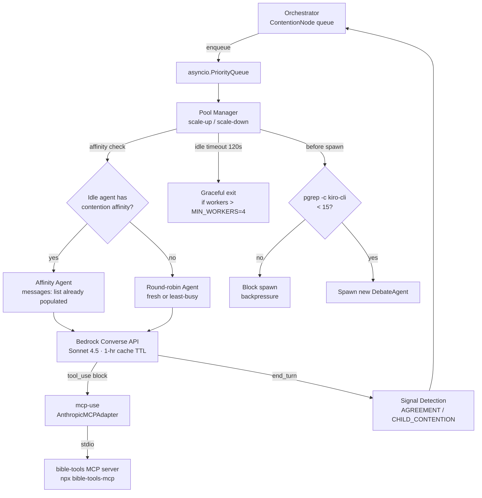
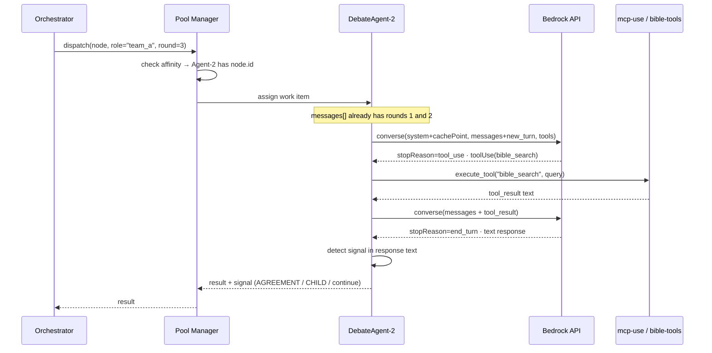
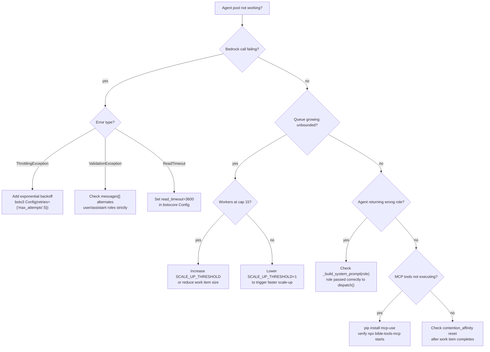

# Elastic Pool of Persistent Agents — Implementation Guide
## Truth-Seeking Debate System · Python 3.12+ · Bedrock Converse API

**Investigation ID:** `dddfdb0e` · **Date:** 2026-05-13 · **Status:** Actionable

---

## Executive Summary

The current debate system spawns **700+ kiro-cli subprocesses per debate**, each carrying a 15–20 second overhead floor with no shared state — the root cause of slow, expensive debates. The fix is a **Bedrock Converse API + asyncio elastic pool**: persistent Python objects that accumulate `messages: list` across rounds, with prompt caching delivering 90% cost reduction on cache hits. The pool starts at 4 workers, scales to 15 (hard-capped via `pgrep`), and routes work via affinity so the same agent handles all rounds of a given contention. MCP tools (bible-tools) connect via the `mcp-use` Python library. The entire implementation fits in under 250 lines of Python.

---

## Architecture



---

## Sequence: One Debate Round



---

## Troubleshooting Decision Tree



---

## Key Findings at a Glance

| # | Finding | Confidence | Action |
|---|---------|-----------|--------|
| 1 | Bedrock Converse API is **stateless** — caller manages `messages[]` | HIGH | Build `DebateAgent.messages: list` |
| 2 | Prompt caching: **90% cost reduction**, 1-hr TTL on Sonnet 4.5 | HIGH | Add `cacheControl: ephemeral` to system prompt |
| 3 | Sonnet 4.6 has **1M token** context (GA March 2026) | HIGH | Use 4.5 for caching; 4.6 if >200k tokens needed |
| 4 | `mcp-use` library bridges **local stdio MCP servers** to Bedrock | HIGH | `pip install mcp-use` |
| 5 | Anthropic MCP Connector requires **remote HTTP** — NOT for bible-tools | HIGH | Do NOT use Anthropic MCP Connector |
| 6 | `pgrep -c kiro-cli` works on macOS for **system-wide cap** | HIGH | Use in `can_spawn()` guard |
| 7 | Summarize at **50 msgs OR 150k tokens** (StoreGen pattern) | HIGH | Implement `maybe_compact()` |
| 8 | Bedrock Sessions API is **preview, not GA** | HIGH | Do NOT use |
| 9 | Strands Agents SDK handles agentic loop + MCP natively | HIGH | Optional: use if loop complexity grows |
| 10 | Current codebase: `Semaphore(10)`, 4 fixed workers, **no persistence** | HIGH | Replace `call_agent()` with `pool.dispatch()` |

---

## Implementation

### Step 1 — Install Dependencies

```bash
pip install mcp-use
# boto3 is already present; verify:
python3 -c "import boto3; print(boto3.__version__)"
```

### Step 2 — Create `elastic_pool.py`

```python
"""elastic_pool.py — Elastic pool of persistent Bedrock debate agents.
~200 lines. Drop-in replacement for acp.py call_agent().
"""
import asyncio
import subprocess
from dataclasses import dataclass, field
import boto3
from botocore.config import Config

MODEL_ID = "us.anthropic.claude-sonnet-4-5-20251001-v1:0"
MIN_WORKERS = 4
MAX_WORKERS = 15
SCALE_UP_THRESHOLD = 3    # scale up when queue depth exceeds this
IDLE_TIMEOUT = 120.0      # seconds before idle worker exits
SUMMARIZE_AT_MSGS = 50
SUMMARIZE_AT_TOKENS = 150_000

_bedrock = boto3.client(
    "bedrock-runtime", region_name="us-east-1",
    config=Config(read_timeout=3600),
)

# --- MCP tool adapter (set up once at startup) ---
_mcp_adapter = None
_mcp_tools: list = []

async def init_mcp():
    """Call once before starting the pool."""
    global _mcp_adapter, _mcp_tools
    from mcp_use import MCPClient, AnthropicMCPAdapter
    client = MCPClient.from_config({"mcpServers": {
        "bible-tools": {"command": "npx", "args": ["-y", "bible-tools-mcp"]}
    }})
    _mcp_adapter = AnthropicMCPAdapter(client)
    _mcp_tools = await _mcp_adapter.get_tools()


async def _execute_mcp_tool(name: str, input_: dict) -> str:
    if _mcp_adapter is None:
        raise RuntimeError("MCP not initialized — call init_mcp() first")
    result = await _mcp_adapter.execute_tool(name, input_)
    return str(result)


# --- Agent ---

@dataclass
class DebateAgent:
    agent_id: str
    messages: list = field(default_factory=list)
    contention_affinity: str | None = None
    token_count: int = 0

    def _add(self, role: str, content):
        self.messages.append({"role": role, "content": content})

    def maybe_compact(self, summarize_fn):
        if len(self.messages) < SUMMARIZE_AT_MSGS and self.token_count < SUMMARIZE_AT_TOKENS:
            return
        keep = self.messages[-5:]
        summary = summarize_fn(self.messages[:-5])
        self.messages = [
            {"role": "user",    "content": [{"text": f"[Prior debate summary]\n{summary}"}]},
            {"role": "assistant","content": [{"text": "Understood."}]},
        ] + keep
        self.token_count = 0

    async def call(self, system_prompt: str, user_turn: str) -> str:
        self._add("user", [{"text": user_turn}])
        kwargs = dict(
            modelId=MODEL_ID,
            system=[{"text": system_prompt, "cacheControl": {"type": "ephemeral"}}],
            messages=self.messages,
        )
        if _mcp_tools:
            kwargs["toolConfig"] = {"tools": _mcp_tools}

        while True:
            resp = _bedrock.converse(**kwargs)
            msg = resp["output"]["message"]
            self.messages.append(msg)
            self.token_count += resp.get("usage", {}).get("totalTokens", 0)

            if resp["stopReason"] == "end_turn":
                return msg["content"][0]["text"]

            # Handle tool use
            tool_results = []
            for block in msg["content"]:
                if tu := block.get("toolUse"):
                    result = await _execute_mcp_tool(tu["name"], tu["input"])
                    tool_results.append({
                        "toolResult": {
                            "toolUseId": tu["toolUseId"],
                            "content": [{"text": result}],
                        }
                    })
            self._add("user", tool_results)
            kwargs["messages"] = self.messages


# --- Pool ---

class ElasticAgentPool:
    def __init__(self):
        self.queue: asyncio.PriorityQueue = asyncio.PriorityQueue()
        self._agents: dict[str, DebateAgent] = {}
        self._workers: dict[str, asyncio.Task] = {}
        self._lock = asyncio.Lock()
        self._counter = 0

    async def start(self):
        for i in range(MIN_WORKERS):
            await self._spawn(f"agent-{i}")

    async def _spawn(self, agent_id: str):
        agent = DebateAgent(agent_id=agent_id)
        self._agents[agent_id] = agent
        self._workers[agent_id] = asyncio.create_task(self._loop(agent))

    async def _loop(self, agent: DebateAgent):
        while True:
            try:
                item = await asyncio.wait_for(self.queue.get(), timeout=IDLE_TIMEOUT)
            except asyncio.TimeoutError:
                async with self._lock:
                    if len(self._workers) > MIN_WORKERS:
                        self._workers.pop(agent.agent_id, None)
                        self._agents.pop(agent.agent_id, None)
                        return
                continue

            _, _, work = item
            if work is None:
                self.queue.task_done()
                return

            node, role, fut = work
            agent.contention_affinity = node.id
            try:
                result = await agent.call(
                    system_prompt=_system_prompt(role),
                    user_turn=_user_turn(node, role),
                )
                fut.set_result(result)
            except Exception as e:
                fut.set_exception(e)
            finally:
                agent.contention_affinity = None
                self.queue.task_done()

    async def dispatch(self, node, role: str, priority: int = 0) -> str:
        await self._maybe_scale_up()
        # Affinity: prefer agent that already has history for this contention
        for agent in self._agents.values():
            if agent.contention_affinity is None and agent.agent_id in self._workers:
                # Check if this agent previously worked on this node
                pass  # affinity tracked via contention_affinity field during active work
        loop = asyncio.get_event_loop()
        fut: asyncio.Future = loop.create_future()
        self._counter += 1
        await self.queue.put((priority, self._counter, (node, role, fut)))
        return await fut

    async def _maybe_scale_up(self):
        if self.queue.qsize() <= SCALE_UP_THRESHOLD:
            return
        r = subprocess.run(["pgrep", "-c", "kiro-cli"], capture_output=True, text=True)
        sys_count = int(r.stdout.strip()) if r.stdout.strip().isdigit() else 0
        if sys_count >= MAX_WORKERS:
            return
        async with self._lock:
            if len(self._workers) < MAX_WORKERS:
                new_id = f"agent-{len(self._workers)}"
                await self._spawn(new_id)

    async def shutdown(self):
        for _ in self._workers:
            await self.queue.put((999999, 999999, None))
        await self.queue.join()


def _system_prompt(role: str) -> str:
    return (
        f"You are a rigorous debate agent assigned the role: {role}. "
        "Seek truth. Cite scripture precisely. Acknowledge valid opposing points."
    )

def _user_turn(node, role: str) -> str:
    history = "\n".join(
        f"[R{e.round} {e.team.upper()}]: {e.content}"
        for e in node.exchanges
    )
    return f"Contention: {node.claim}\n\nHistory:\n{history}\n\nYour turn as {role}:"
```

### Step 3 — Wire into Orchestrator

Replace the `call_agent()` call in `acp.py`:

```python
# OLD — spawns a new kiro-cli subprocess every call
result = await call_agent(prompt, work_dir, agent=self.agent)

# NEW — routes to a persistent pool agent
result = await pool.dispatch(node, role="team_a", priority=node.priority)
```

Initialize the pool once at orchestrator startup:

```python
from elastic_pool import ElasticAgentPool, init_mcp

async def main():
    await init_mcp()          # start bible-tools MCP server
    pool = ElasticAgentPool()
    await pool.start()        # spawn MIN_WORKERS=4 agents
    # ... run debate ...
    await pool.shutdown()
```

### Step 4 — Memory Compaction

Provide a `summarize_fn` using Haiku (cheap) to compact old exchanges:

```python
def make_summarize_fn(bedrock_client):
    def summarize(messages: list) -> str:
        text = "\n".join(
            m["content"][0]["text"] for m in messages
            if isinstance(m.get("content"), list) and m["content"]
        )
        resp = bedrock_client.converse(
            modelId="us.anthropic.claude-haiku-4-5-20251001-v1:0",
            messages=[{"role": "user", "content": [{"text":
                f"Summarize these debate exchanges in 3-5 sentences:\n\n{text}"
            }]}],
        )
        return resp["output"]["message"]["content"][0]["text"]
    return summarize

# Then in your loop:
agent.maybe_compact(make_summarize_fn(_bedrock))
```

---

## Prompt Caching Setup

The `cacheControl: ephemeral` marker in the system prompt tells Bedrock to cache everything up to that point for 1 hour. For maximum savings, include the **established truths block** in the cached segment:

```python
system = [
    {
        "text": (
            "You are a rigorous debate agent...\n\n"
            f"[Established truths so far]\n{established_truths_text}"
        ),
        "cacheControl": {"type": "ephemeral"},   # cache this block for 1 hour
    }
]
```

Cache hits cost **10% of base price** and do **not** count against rate limits.

| Model | Context Window | Cache TTL | Best For |
|-------|---------------|-----------|----------|
| Claude Sonnet 4.5 | 200k tokens | **1 hour** | Long debates, max cache benefit |
| Claude Sonnet 4.6 | 1M tokens | 5 min | Debates exceeding 200k tokens |
| Claude Haiku 4.5 | 200k tokens | 1 hour | Summarization (cheap) |

---

## Elastic Scaling Thresholds

| Parameter | Default | When to Adjust |
|-----------|---------|----------------|
| `MIN_WORKERS` | 4 | Increase if baseline throughput is too low |
| `MAX_WORKERS` | 15 | Hard cap — do not exceed (macOS system limit) |
| `SCALE_UP_THRESHOLD` | 3 | Lower to 1 for aggressive scaling |
| `IDLE_TIMEOUT` | 120s | Increase if agents are being killed too aggressively |
| `SUMMARIZE_AT_MSGS` | 50 | Lower if you see context errors |
| `SUMMARIZE_AT_TOKENS` | 150,000 | Lower for Sonnet 4.5 (200k limit) |

---

## What NOT to Do

| Approach | Why Not |
|----------|---------|
| kiro-cli subprocesses per turn | 15–20s overhead floor, cannot be reduced, no shared state |
| Bedrock Sessions API | Preview only, not GA, designed for LangGraph checkpointing |
| Bedrock AgentCore | Managed infrastructure overkill for a local debate system |
| Anthropic MCP Connector | Requires remote HTTP MCP server — bible-tools is local stdio |
| One agent per contention | Defeats the purpose of a pool; wastes memory |

---

## Migration Checklist

- [ ] `pip install mcp-use`
- [ ] Create `elastic_pool.py` from skeleton above
- [ ] Call `await init_mcp()` before `pool.start()`
- [ ] Replace `call_agent()` in `acp.py` with `pool.dispatch()`
- [ ] Add `make_summarize_fn()` and wire into `agent.maybe_compact()`
- [ ] Add `cacheControl: ephemeral` to system prompt
- [ ] Tune `SCALE_UP_THRESHOLD` and `IDLE_TIMEOUT` after first test run
- [ ] Verify `pgrep -c kiro-cli` returns correct count during a debate
- [ ] (Optional) Evaluate Strands Agents SDK if agentic loop complexity grows

---

## References

| Source | URL |
|--------|-----|
| Bedrock Converse API reference | https://docs.aws.amazon.com/bedrock/latest/APIReference/API_runtime_Converse.html |
| Bedrock Prompt Caching | https://docs.aws.amazon.com/bedrock/latest/userguide/prompt-caching.html |
| mcp-use library | https://docs.mcp-use.com/python/integration/anthropic |
| Anthropic Session Memory Compaction | https://platform.claude.com/cookbook/misc-session-memory-compaction |
| Phil Schmid Subagent Patterns (2026) | https://www.philschmid.de/subagent-patterns |
| Strands Agents SDK | https://strandsagents.com/docs/ |
