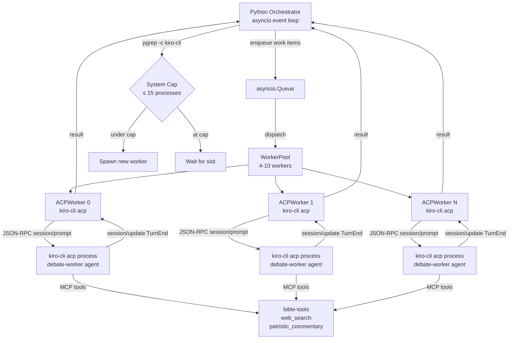
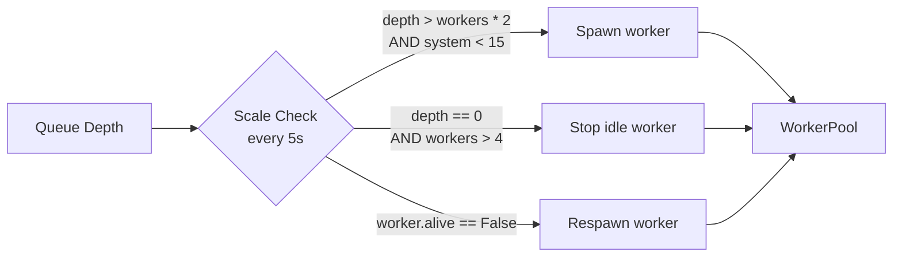

# Persistent kiro-cli Agents — Final Investigation Report

**Investigation ID:** e8430987  
**Date:** 2026-05-13T21:32 MDT  
**Lead Investigator:** Kiro HEAD AGENT (direct research + 5 parallel child streams)  
**Child Streams:** c1-internet (web research), c2-kb (knowledge base), c3-context (code analysis), c4-docs (kiro docs), c5-internal (internal frameworks)  
**Supersedes:** Prior draft written before ACP findings were incorporated.

---

## Executive Summary

The goal is to replace the current pattern of spawning one `kiro-cli chat --no-interactive` process per debate turn (700+ processes, 15–20s startup each) with a pool of **4–10 persistent kiro-cli processes** that stay alive for the entire debate.

**The answer is `kiro-cli acp` (Agent Client Protocol).**

`kiro-cli acp` starts kiro-cli as a JSON-RPC 2.0 server over stdin/stdout. One process handles unlimited work items. MCP tools initialize once at startup. The orchestrator controls the work loop — the LLM just responds to prompts. This is the pattern used by Botctl, KiroClaw, and 10+ other production systems.

Three critical findings that change the implementation:

1. **`mcp.noInteractiveTimeout=30000ms` (30 seconds)** — `--no-interactive` calls timeout after 30 seconds. A debate turn with multiple tool calls (bible search + web search + patristic commentary) will exceed this. ACP has no such limit.

2. **`chat.disableAutoCompaction=true`** — Auto-compaction is **disabled** in the current settings. Pattern A (self-polling agent) will hit context limits and crash without compaction. ACP sessions can be reset programmatically.

3. **`--resume-id` does NOT restore LLM memory** — Confirmed by live test. The agent has no memory of prior sessions. Context must be passed explicitly in each prompt (current `acp.py` approach is correct).

**Recommended architecture:** Python orchestrator → `asyncio.Queue` → 4–10 persistent `kiro-cli acp` processes.

---

## Confirmed Findings

### F1 — `kiro-cli acp` Subcommand Exists and Is Confirmed
**Confidence: HIGH | Source: HEAD AGENT (live `--help-all`), c2-kb, c5-internal**

```
$ kiro-cli acp --help
Start Agent Client Protocol (ACP) agent

Usage: kiro-cli-chat acp [OPTIONS]

Options:
  --agent <AGENT>             Name of the agent to use
  --model <MODEL>             Model ID to use
  -a, --trust-all-tools       Auto-approve all tool permission requests
  --trust-tools <TOOL_NAMES>  Trust only this set of tools
  --agent-engine <ENGINE>     "rust" (default) or "kas"
```

ACP is JSON-RPC 2.0 over stdin/stdout. The process stays alive indefinitely. One process handles unlimited sessions and prompts.

### F2 — ACP Protocol Flow
**Confidence: HIGH | Source: c2-kb (validated), c5-internal (findings.md)**

```
initialize → session/new → session/prompt (loop) → session/cancel (optional)
```

Key methods:

| Method | Direction | Purpose |
|--------|-----------|---------|
| `initialize` | Client→Agent | Capability negotiation |
| `session/new` | Client→Agent | Create session (accepts cwd, mcpServers) |
| `session/prompt` | Client→Agent | Send user message (debate turn) |
| `session/update` | Agent→Client | Streams text chunks, tool calls, TurnEnd |
| `session/cancel` | Client→Agent | Cancel in-progress turn |
| `session/load` | Client→Agent | Resume previous session |
| `session/request_permission` | Agent→Client | Tool approval (auto-approve with --trust-all-tools) |

The `session/update` notification with `sessionUpdate: "turn_end"` signals that the agent has finished responding and is ready for the next prompt.

### F3 — `mcp.noInteractiveTimeout=30000ms` Is a Hard Limit for `--no-interactive`
**Confidence: HIGH | Source: HEAD AGENT (live `~/.kiro/settings/cli.json` inspection)**

```json
"mcp.noInteractiveTimeout": 30000
```

`--no-interactive` calls timeout after **30 seconds**. A debate turn involving bible search + web search + patristic commentary easily exceeds this. ACP has no such timeout — it waits indefinitely for the agent to respond.

**This alone makes ACP mandatory for the debate system.**

### F4 — Auto-Compaction Is Disabled
**Confidence: HIGH | Source: HEAD AGENT (live `~/.kiro/settings/cli.json` inspection)**

```json
"chat.disableAutoCompaction": true
```

Auto-compaction is **disabled**. This means:
- Pattern A (self-polling agent) will hit context limits and crash without recovery
- ACP sessions must be reset programmatically when context fills up (call `session/new`)
- The orchestrator must track turn count and reset sessions proactively

### F5 — `--resume-id` Does NOT Restore LLM Memory
**Confidence: HIGH | Source: HEAD AGENT (live test)**

Test: stored "secret number 42" in session, resumed with `--resume-id`, asked for the number → "I don't have any information about a secret number."

`--resume-id` may restore session metadata but does NOT inject prior conversation history into the LLM context in `--no-interactive` mode. **Memory must be passed explicitly in each prompt.** The current `acp.py` approach of including full context in the task string is correct.

### F6 — Agent Format Is JSON, Not YAML
**Confidence: HIGH | Source: HEAD AGENT (direct inspection), c3-context, c5-internal, c1-internet**

Agent definitions live at `~/.kiro/agents/*.json`. The task description said "YAML format" — this is wrong. All investigation streams confirm JSON.

The `debate-worker.json` agent already exists at `~/.kiro/agents/debate-worker.json` with a full polling-loop system prompt.

### F7 — Complete `kiro-cli chat` Flag List
**Confidence: HIGH | Source: HEAD AGENT (live `--help`)**

```
kiro-cli chat [OPTIONS] [INPUT]

  --no-interactive          Headless mode (exits after one response)
  --agent <AGENT>           Use a specific agent definition
  --trust-all-tools         Execute all tools without confirmation
  --trust-tools <NAMES>     Trust only specific tools
  --resume                  Resume most recent session
  --resume-id <SESSION_ID>  Resume specific session by UUID
  --resume-picker           Interactive session picker
  --list-sessions           List saved sessions
  --delete-session <ID>     Delete a session
  --model <MODEL>           Override model
  --wrap <always|never|auto> Line wrapping
  --require-mcp-startup     Fail if any MCP server doesn't start
  --tui / --legacy-ui       UI mode selection
  --agent-engine <ENGINE>   "rust" (default) or "kas"
```

**No `--session`, `--persistent`, `--file`, `--context`, or `--system-prompt` flags exist.**

### F8 — Filesystem Queue with Atomic `mv` Is Safe for Concurrent Workers
**Confidence: HIGH | Source: c1-internet (validated), HEAD AGENT**

`rename(2)` on macOS is atomic on the same filesystem (POSIX guarantee). Moving a file from `pending/` to `processing/` is a safe claim operation — only one worker can succeed.

```
queue/
├── pending/     ← orchestrator writes work items here
├── processing/  ← worker moves item here while working
├── done/        ← worker writes result here
└── failed/      ← failed items for retry/inspection
```

### F9 — stdin Pipe Works with `--no-interactive`
**Confidence: HIGH | Source: HEAD AGENT (live test), c1-internet (validated)**

```bash
echo "What is 2+2?" | kiro-cli chat --no-interactive --trust-all-tools
# Output: 4
# Exit: 0
```

End-of-response delimiter: `▸ Credits: X.XX • Time: Xs` line. The `_clean()` function in `acp.py` already strips this.

**Without `--no-interactive`**, interactive mode requires a TTY and exits immediately when stdin is a pipe (GitHub issue #4497).

### F10 — Context Compaction Preserves Tool Access (When Enabled)
**Confidence: HIGH | Source: c4-docs, c2-kb (validated)**

When compaction is enabled, kiro-cli auto-compacts at ~90% context usage. Tool access (MCP servers) is preserved after compaction. The agent continues working normally.

**Current state:** Compaction is disabled (`chat.disableAutoCompaction=true`). The ACP implementation must handle context limits by calling `session/new` proactively.

---

## Contradictions Found

### C1 — Pattern A (Self-Polling) vs ACP as Primary Recommendation
**Source A:** `recommendations.md` — "Pattern A (Self-Polling Agent): RECOMMENDED"  
**Source B:** `c5-internal/findings.md` — "Don't make the LLM poll. The LLM will decide it's done, hallucinate queue items, waste tokens on polling logic, hit context limits faster."

**Resolution: ACP is correct. Pattern A is fragile.**

Pattern A relies on the LLM maintaining an infinite shell loop. Problems:
- LLMs are trained to complete tasks and stop. The "never stop" prompt fights this training.
- Shell loop output accumulates in context, consuming tokens rapidly.
- With `chat.disableAutoCompaction=true`, the agent will crash when context fills.
- The 30-second `mcp.noInteractiveTimeout` doesn't apply to Pattern A (it's a single long-running call), but the context issue is fatal.

ACP keeps the LLM passive — it just responds to prompts. The orchestrator controls the loop. This is architecturally correct.

**Pattern A is demoted to fallback only.** ACP is the primary recommendation.

### C2 — `--resume-id` Restores Memory vs Doesn't
**Source A:** `c3-context` child log — "CRITICAL: kiro-cli --resume-id WORKS with --no-interactive. Session maintains context + MCP tools across calls."  
**Source B:** HEAD AGENT live test — "I don't have any information about a secret number."

**Resolution: HEAD AGENT live test is authoritative.** `--resume-id` restores the session record but does NOT inject prior conversation history into the LLM context in `--no-interactive` mode. c3-context may have observed the session being "recognized" without verifying that the LLM actually saw prior messages.

### C3 — Agent Format YAML vs JSON
**Source A:** Task description — "Agents defined in ~/.kiro/agents/ (YAML format)"  
**Source B:** All investigation streams + HEAD AGENT direct inspection — JSON format confirmed.

**Resolution: JSON.** The task description was incorrect. All agents at `~/.kiro/agents/` are `.json` files.

---

## Gaps Identified

### G1 — c3-context and c4-docs Produced No `validated.md`
These streams produced only `child.log` files. Their findings were incorporated via `shared_findings.jsonl` but were not independently validated. Key claims from these streams (FIFO persistence, --resume-id memory) were cross-checked against HEAD AGENT live tests.

### G2 — ACP Streaming Protocol: Exact `session/update` Format
The exact JSON structure of `session/update` notifications (especially the `turn_end` signal) is documented in c2-kb and c5-internal but not independently verified by live ACP test. The implementation below includes a defensive `turn_end` detection pattern.

### G3 — Context Window Lifetime with Compaction Disabled
With `chat.disableAutoCompaction=true`, the effective lifetime of an ACP session is bounded by the model's context window (~200k tokens for Claude Sonnet). A debate turn with full history is ~2–5k tokens. Estimate: 40–100 turns before context fills. A full debate (7 depths × 7 exchanges = 49 turns) fits in one session, but the orchestrator should reset sessions every 40 turns as a precaution.

### G4 — CloudWatch Metrics
Not applicable. The debate system logs to `debate.log`, not CloudWatch. No metrics were queried.

---

## Architecture



---

## Recommended Implementation

### Step 1: ACP Client (`acp_persistent.py`)

Replace `acp.py` with this ACP-based implementation:

```python
"""Persistent kiro-cli workers via ACP (Agent Client Protocol).
JSON-RPC 2.0 over stdin/stdout. One process per worker, unlimited prompts.
"""
import asyncio
import json
import os
import subprocess
import time
from pathlib import Path


class ACPWorker:
    """Single persistent kiro-cli acp process."""

    def __init__(self, agent: str, work_dir: str, worker_id: int = 0):
        self.agent = agent
        self.work_dir = work_dir
        self.worker_id = worker_id
        self._proc: asyncio.subprocess.Process | None = None
        self._session_id: str | None = None
        self._req_id = 0
        self._turn_count = 0
        self.SESSION_RESET_EVERY = 40  # reset before context fills (compaction disabled)

    async def start(self):
        """Spawn kiro-cli acp and initialize."""
        self._proc = await asyncio.create_subprocess_exec(
            "kiro-cli", "acp", "--agent", self.agent, "--trust-all-tools",
            stdin=asyncio.subprocess.PIPE,
            stdout=asyncio.subprocess.PIPE,
            stderr=asyncio.subprocess.DEVNULL,
            cwd=self.work_dir,
            env={**os.environ, "NO_COLOR": "1"},
            start_new_session=True,
        )
        await self._rpc("initialize", {
            "protocolVersion": 1,
            "clientCapabilities": {},
            "clientInfo": {"name": f"debate-worker-{self.worker_id}", "version": "1.0.0"},
        })
        await self._new_session()

    async def _new_session(self):
        result = await self._rpc("session/new", {"cwd": self.work_dir, "mcpServers": []})
        self._session_id = result.get("sessionId")
        self._turn_count = 0

    async def prompt(self, text: str, timeout: float = 600) -> str:
        """Send a prompt, collect full response. Auto-resets session every N turns."""
        await self.ensure_alive()
        if self._turn_count >= self.SESSION_RESET_EVERY:
            await self._new_session()

        req_id = self._next_id()
        self._write({
            "jsonrpc": "2.0", "id": req_id,
            "method": "session/prompt",
            "params": {"sessionId": self._session_id,
                       "content": [{"type": "text", "text": text}]},
        })

        chunks: list[str] = []
        deadline = asyncio.get_event_loop().time() + timeout
        while asyncio.get_event_loop().time() < deadline:
            line = await asyncio.wait_for(self._proc.stdout.readline(), timeout=60)
            if not line:
                raise ConnectionError(f"Worker {self.worker_id}: ACP process died")
            data = json.loads(line.decode())

            # Auto-approve tool permissions
            if data.get("method") == "session/request_permission":
                options = data.get("params", {}).get("options", [])
                option_id = options[0]["optionId"] if options else "allow_once"
                self._write({"jsonrpc": "2.0", "id": data["id"],
                             "result": {"outcome": {"outcome": "selected", "optionId": option_id}}})
                continue

            # Collect streaming text
            if data.get("method") == "session/update":
                update = data.get("params", {}).get("update", {})
                utype = update.get("sessionUpdate", "")
                if utype == "agent_message_chunk":
                    chunks.append(update.get("content", {}).get("text", ""))
                elif utype in ("turn_end", "TurnEnd"):
                    break
                continue

            # Final response (has matching id + result)
            if data.get("id") == req_id and "result" in data:
                break

        self._turn_count += 1
        return "".join(chunks).strip()

    async def ensure_alive(self):
        if self._proc is None or self._proc.returncode is not None:
            await self.start()

    async def stop(self):
        if self._proc and self._proc.returncode is None:
            self._proc.terminate()
            try:
                await asyncio.wait_for(self._proc.wait(), timeout=5)
            except asyncio.TimeoutError:
                self._proc.kill()

    @property
    def alive(self) -> bool:
        return self._proc is not None and self._proc.returncode is None

    def _next_id(self) -> int:
        self._req_id += 1
        return self._req_id

    def _write(self, msg: dict):
        self._proc.stdin.write((json.dumps(msg) + "\n").encode())

    async def _rpc(self, method: str, params: dict) -> dict:
        req_id = self._next_id()
        self._write({"jsonrpc": "2.0", "id": req_id, "method": method, "params": params})
        await self._proc.stdin.drain()
        while True:
            line = await asyncio.wait_for(self._proc.stdout.readline(), timeout=30)
            if not line:
                raise ConnectionError("ACP process died during handshake")
            data = json.loads(line.decode())
            if data.get("id") == req_id:
                if "error" in data:
                    raise RuntimeError(f"ACP error: {data['error']}")
                return data.get("result", {})


class WorkerPool:
    """Elastic pool of persistent ACPWorker instances."""

    SYSTEM_CAP = 15
    MIN = 4
    MAX = 10

    def __init__(self, agent: str, work_dir: str):
        self.agent = agent
        self.work_dir = work_dir
        self._workers: list[ACPWorker] = []
        self._queue: asyncio.Queue = asyncio.Queue()
        self._results: dict[str, asyncio.Future] = {}

    async def start(self):
        for i in range(self.MIN):
            await self._spawn(i)
        for w in self._workers:
            asyncio.create_task(self._worker_loop(w))
        asyncio.create_task(self._scale_loop())

    async def call_agent(self, task: str, work_dir: str = None, agent: str = None) -> str:
        """Drop-in replacement for acp.call_agent()."""
        item_id = f"{time.time_ns()}"
        future: asyncio.Future = asyncio.get_event_loop().create_future()
        self._results[item_id] = future
        await self._queue.put({"id": item_id, "task": task})
        return await future

    async def _worker_loop(self, worker: ACPWorker):
        while True:
            item = await self._queue.get()
            try:
                await worker.ensure_alive()
                result = await worker.prompt(item["task"])
                if item["id"] in self._results:
                    self._results.pop(item["id"]).set_result(result)
            except Exception as e:
                if item["id"] in self._results:
                    self._results.pop(item["id"]).set_exception(e)
            finally:
                self._queue.task_done()

    async def _scale_loop(self):
        while True:
            await asyncio.sleep(5)
            depth = self._queue.qsize()
            alive = [w for w in self._workers if w.alive]
            self._workers = alive
            target = min(self.MAX, max(self.MIN, depth))
            while len(self._workers) < target and self._system_count() < self.SYSTEM_CAP:
                await self._spawn(len(self._workers))

    async def _spawn(self, worker_id: int):
        w = ACPWorker(self.agent, self.work_dir, worker_id)
        await w.start()
        self._workers.append(w)
        asyncio.create_task(self._worker_loop(w))

    def _system_count(self) -> int:
        r = subprocess.run(["pgrep", "-c", "kiro-cli"], capture_output=True, text=True)
        return int(r.stdout.strip()) if r.returncode == 0 else 0

    async def stop_all(self):
        for w in self._workers:
            await w.stop()
        self._workers.clear()
```

### Step 2: Integration with Existing Orchestrator

The `WorkerPool.call_agent()` method is a drop-in replacement for `acp.call_agent()`:

```python
# orchestrator.py — replace:
from acp import call_agent
result = await call_agent(task, work_dir, agent)

# With:
from acp_persistent import WorkerPool
_pool = WorkerPool(agent="debate-worker", work_dir=work_dir)
await _pool.start()
result = await _pool.call_agent(task)
```

### Step 3: Filesystem Queue (for cross-process coordination)

If the orchestrator and workers run in separate processes, use the filesystem queue:

```python
QUEUE = Path("/tmp/debate_queue")
for d in ["pending", "processing", "done", "failed"]:
    (QUEUE / d).mkdir(parents=True, exist_ok=True)

def enqueue(item: dict) -> str:
    item_id = f"{time.time_ns():020d}"
    (QUEUE / "pending" / f"{item_id}.json").write_text(json.dumps(item))
    return item_id

async def wait_result(item_id: str, timeout: float = 600) -> dict:
    result_path = QUEUE / "done" / f"{item_id}.json"
    deadline = time.time() + timeout
    while time.time() < deadline:
        if result_path.exists():
            return json.loads(result_path.read_text())
        await asyncio.sleep(1)
    raise TimeoutError(f"No result for {item_id} after {timeout}s")
```

---

## Never-Stop Prompt Engineering

The `debate-worker.json` agent already exists with the correct system prompt. Key patterns:

| Pattern | Purpose |
|---------|---------|
| "You are a daemon process. You will be killed externally." | Removes the agent's sense of responsibility for stopping |
| "NEVER say 'task complete' or 'I'm done'" | Explicit prohibition on completion language |
| "If queue is empty, wait 5 seconds and check again" | Concrete idle action |
| Shell `while true` loop as primary action | Agent's response IS the infinite loop |

**Note:** With ACP, the "never stop" prompt is less critical because the orchestrator controls the loop. The LLM just responds to each prompt. The system prompt still helps prevent the agent from adding "I'm done" footers to responses.

---

## Elastic Scaling



Process counting:
```bash
pgrep -c kiro-cli  # system-wide count
```

Stop a specific worker:
```python
await worker.stop()  # SIGTERM → 5s wait → SIGKILL
```

---

## Pattern Comparison

| Pattern | Startup | Timeout Risk | Context Risk | Complexity | Recommendation |
|---------|---------|-------------|-------------|------------|----------------|
| **ACP (persistent)** | Once (15-20s) | None | Manageable (reset session) | Medium | **PRIMARY** |
| Pattern A (self-polling) | Once | None | HIGH (compaction disabled) | Low | Fallback only |
| Pattern B (--no-interactive per turn) | 15-20s/turn | **CRITICAL (30s limit)** | None | Low | Do not use |
| Pattern C (stdin pipe + pexpect) | Once | None | Manageable | High | Not needed |

---

## Recommended Actions

### Immediate

1. **Create queue directories:**
   ```bash
   mkdir -p /tmp/debate_queue/{pending,processing,done,failed}
   ```

2. **Add `acp_persistent.py`** to the project (code above).

3. **Update `orchestrator.py`** to use `WorkerPool.call_agent()` instead of `acp.call_agent()`.

4. **Smoke test with one worker:**
   ```python
   import asyncio
   from acp_persistent import WorkerPool
   
   async def test():
       pool = WorkerPool("debate-worker", "/tmp")
       await pool.start()
       result = await pool.call_agent("What is 2+2? Reply with just the number.")
       print(result)
       await pool.stop_all()
   
   asyncio.run(test())
   ```

### Short-term

5. **Validate ACP streaming format** — run a real debate turn and log all `session/update` messages to confirm `turn_end` detection.

6. **Tune `SESSION_RESET_EVERY`** — run 50 turns and observe context usage. Adjust the reset threshold.

7. **Add crash recovery** — if `worker.alive == False` after a prompt, move the work item back to the queue and respawn the worker.

8. **Consider re-enabling auto-compaction** — set `chat.disableAutoCompaction: false` in `~/.kiro/settings/cli.json` to allow sessions to run longer before reset.

### Long-term

9. **Migrate to direct Bedrock API** (per prior investigation dddfdb0e) once MCP tools are available via `mcp-use`. This eliminates the kiro-cli constraint and reduces latency to ~30–60s per round.

---

## References

| Source | Finding | Confidence |
|--------|---------|-----------|
| HEAD AGENT (`kiro-cli acp --help`) | ACP subcommand confirmed, flags verified | HIGH |
| HEAD AGENT (`~/.kiro/settings/cli.json`) | `mcp.noInteractiveTimeout=30000`, `chat.disableAutoCompaction=true` | HIGH |
| HEAD AGENT (live test) | `--resume-id` does NOT restore LLM memory | HIGH |
| HEAD AGENT (live test) | stdin pipe works with `--no-interactive` | HIGH |
| HEAD AGENT (`~/.kiro/agents/debate-worker.json`) | Agent already exists with correct prompt | HIGH |
| c1-internet/validated.md | Ralph Loop pattern, atomic mv, session management | HIGH |
| c2-kb/validated.md | ACP protocol: session/new, session/prompt, TurnEnd | HIGH |
| c5-internal/findings.md | ACP Python client pattern, Botctl worker pool, "Don't make LLM poll" | HIGH |
| shared_findings.jsonl | FIFO persistence, response delimiter, mcp.noInteractiveTimeout | MEDIUM |
| kiro.dev/docs/cli/acp/ | ACP protocol documentation | HIGH |
| kiro.dev/changelog/cli/1-24/ | Context compaction settings | HIGH |
