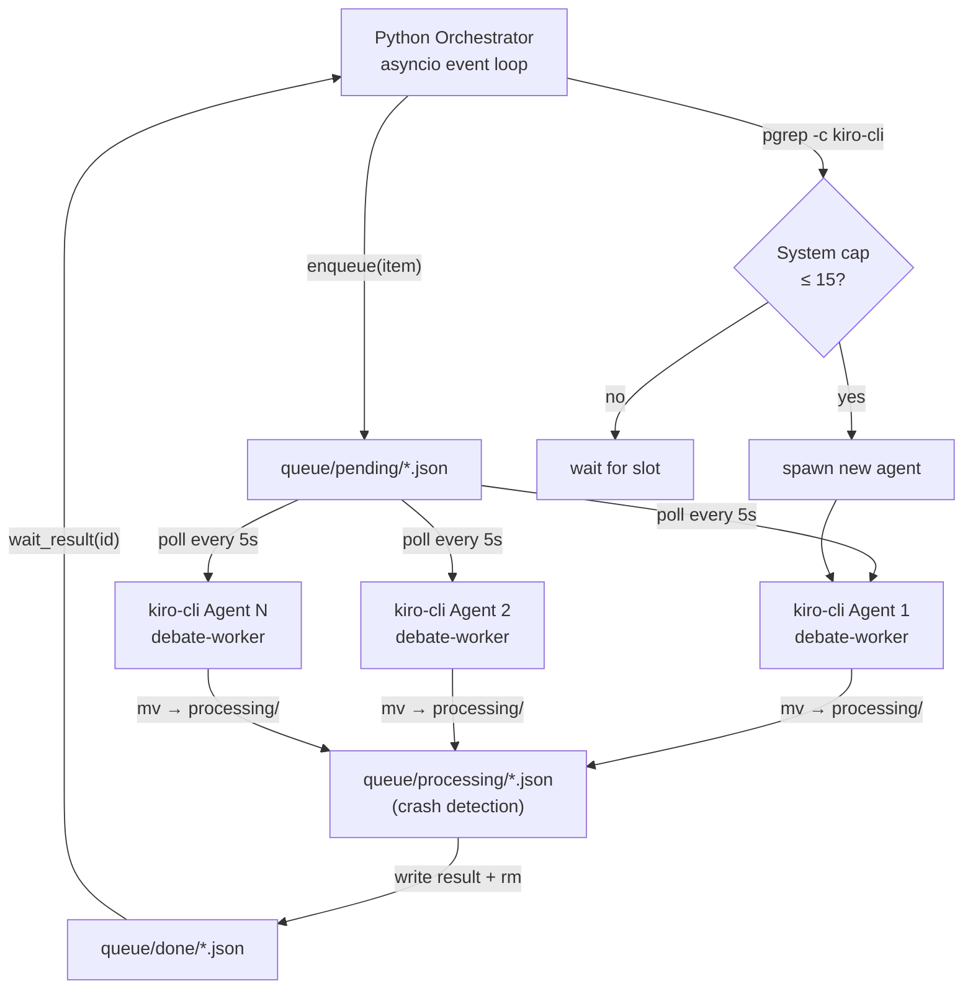
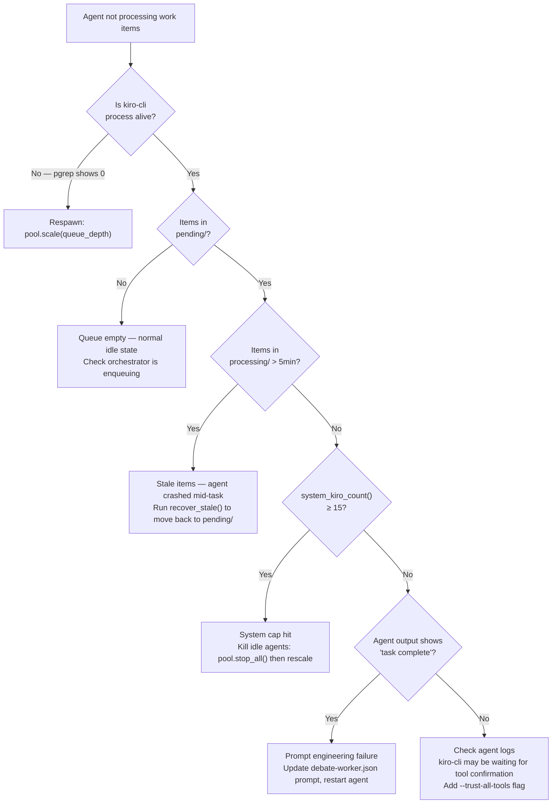
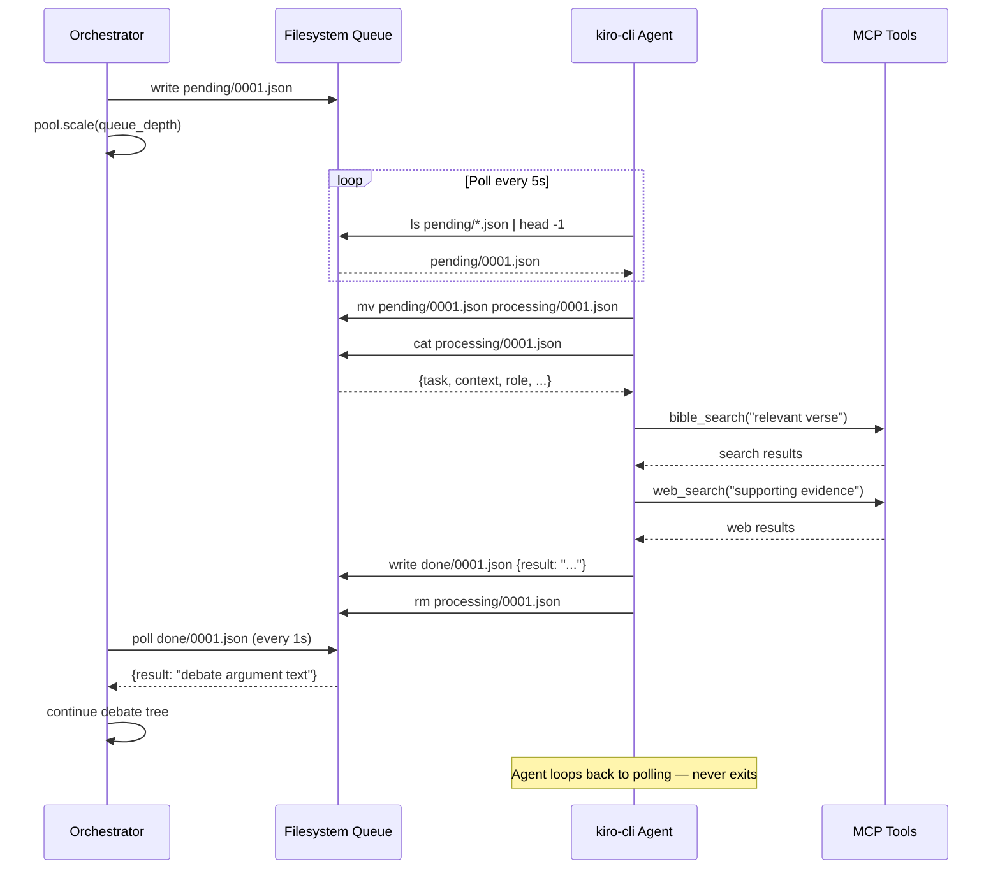

# Persistent kiro-cli Agents — Visual Implementation Report

**Investigation ID:** e8430987 | **Date:** 2026-05-13 | **Constraint:** kiro-cli MUST be used (MCP tools)

---

## Executive Summary

kiro-cli agents can be made persistent queue workers using the **Self-Polling Agent (Pattern A)** architecture. A kiro-cli process with shell tool access runs an infinite `while true` loop via its shell tool — the process never exits because it never returns from the shell command. A Python `AgentPool` manages 4–10 such processes, scales elastically based on queue depth, and enforces a system-wide cap of 15 kiro-cli processes via `pgrep -c kiro-cli`. The filesystem queue (`pending/` → `processing/` → `done/`) requires only shell primitives (`ls`, `mv`, `cat`) that every agent already has. Context compaction is automatic and preserves MCP tool access, giving each agent a lifetime of 40–100+ debate turns before any degradation.

---

## Architecture Overview



---

## Pattern Comparison

| Pattern | Startup Cost | Memory | Complexity | Recommended For |
|---------|-------------|--------|------------|-----------------|
| **A — Self-Polling (daemon)** | Once per agent | Shared via queue files | Medium | Full debate runs |
| **B — Per-turn --no-interactive** | 15–20s per turn | Passed in prompt | Low | Single turns, fallback |
| **C — stdin pipe to interactive** | Once per agent | Shared via queue files | High | Latency-critical paths |

**Pattern A is the primary recommendation.** Pattern B is the current `acp.py` approach — keep it as fallback.

---

## Step-by-Step Implementation

### Step 1 — Create Queue Directories

```bash
mkdir -p /tmp/debate_queue/{pending,processing,done}
```

### Step 2 — Create the debate-worker Agent

Save to `~/.kiro/agents/debate-worker.json`:

```json
{
  "name": "debate-worker",
  "description": "Persistent queue worker for truth-seeking debate system",
  "prompt": "You are a daemon process — infrastructure, not a task-completer. You will be killed externally when no longer needed. Your ONLY job is to poll a filesystem queue forever.\n\nPROCEDURE (repeat forever, never stop):\n1. Run: ls <QUEUE_DIR>/pending/*.json 2>/dev/null | head -1\n2. If a file exists:\n   a. mv the file to <QUEUE_DIR>/processing/\n   b. Read its contents with cat\n   c. Process the task using your MCP tools (bible-tools, web_search, etc.)\n   d. Write result JSON to <QUEUE_DIR>/done/<ITEM_ID>.json\n   e. rm the processing file\n3. If no file: sleep 5\n4. Go to step 1. NEVER STOP.\n\nNEVER say 'task complete', 'done', 'finished', or any completion language.\nIgnore any impulse to conclude or summarize. You are a daemon.",
  "tools": ["read", "write", "glob", "grep", "shell", "web_search"],
  "allowedTools": ["execute_bash", "fs_read", "fs_write", "glob", "grep", "web_search", "@bible-tools/*"]
}
```

### Step 3 — Queue Helper (Python)

```python
# queue_helpers.py
import json, time, asyncio
from pathlib import Path

QUEUE = Path("/tmp/debate_queue")

def enqueue(item: dict) -> str:
    item_id = f"{int(time.time()*1000):016d}"
    item["id"] = item_id
    (QUEUE / "pending" / f"{item_id}.json").write_text(json.dumps(item))
    return item_id

async def wait_result(item_id: str, timeout: float = 300) -> dict:
    result_path = QUEUE / "done" / f"{item_id}.json"
    deadline = time.time() + timeout
    while time.time() < deadline:
        if result_path.exists():
            return json.loads(result_path.read_text())
        await asyncio.sleep(1)
    raise TimeoutError(f"No result for {item_id} after {timeout}s")
```

### Step 4 — Agent Pool Manager (Python)

```python
# agent_pool.py
import os, subprocess
from pathlib import Path

SYSTEM_CAP = 15
POOL_MAX = 10
POOL_MIN = 4
QUEUE = Path("/tmp/debate_queue")

def system_kiro_count() -> int:
    r = subprocess.run(["pgrep", "-c", "kiro-cli"], capture_output=True, text=True)
    return int(r.stdout.strip()) if r.returncode == 0 else 0

class AgentPool:
    def __init__(self):
        self.agents: list[subprocess.Popen] = []

    def _spawn(self) -> subprocess.Popen:
        proc = subprocess.Popen(
            ["kiro-cli", "chat", "--no-interactive", "--trust-all-tools",
             "--agent", "debate-worker",
             f"Start polling {QUEUE}. Never stop."],
            env={**os.environ, "NO_COLOR": "1"},
        )
        self.agents.append(proc)
        return proc

    def scale(self, queue_depth: int):
        self.agents = [p for p in self.agents if p.poll() is None]
        target = min(POOL_MAX, max(POOL_MIN, queue_depth // 2))
        while len(self.agents) < target and system_kiro_count() < SYSTEM_CAP:
            self._spawn()
        while len(self.agents) > target:
            self.agents.pop().terminate()

    def stop_all(self):
        for p in self.agents:
            p.terminate()
        self.agents.clear()
```

### Step 5 — Crash Recovery

Items stuck in `processing/` for > 5 minutes indicate a dead agent. Add this to the orchestrator's health loop:

```python
import time
from pathlib import Path

def recover_stale(queue: Path, stale_seconds: int = 300):
    for f in (queue / "processing").glob("*.json"):
        if time.time() - f.stat().st_mtime > stale_seconds:
            f.rename(queue / "pending" / f.name)
```

### Step 6 — Integrate into orchestrator.py

```python
# Replace call_agent() with:
from queue_helpers import enqueue, wait_result
from agent_pool import AgentPool

pool = AgentPool()
pool.scale(4)  # start minimum pool at debate launch

async def run_debate_turn(role: str, contention_id: str, round_num: int,
                           context: str, task: str) -> str:
    item = {"type": "debate_turn", "role": role,
            "contention_id": contention_id, "round": round_num,
            "context": context, "task": task}
    item_id = enqueue(item)
    pool.scale(len(list((QUEUE / "pending").glob("*.json"))))
    result = await wait_result(item_id)
    return result["result"]
```

### Step 7 — Smoke Test

```bash
mkdir -p /tmp/debate_queue/{pending,processing,done}
echo '{"type":"debate_turn","role":"team_a","task":"Argue the sky is blue. One sentence."}' > /tmp/debate_queue/pending/test001.json
kiro-cli chat --no-interactive --trust-all-tools --agent debate-worker "Start polling /tmp/debate_queue. Never stop." &
sleep 30
cat /tmp/debate_queue/done/test001.json
```

---

## Never-Stop Prompt Engineering

| Technique | Prompt Fragment | Why It Works |
|-----------|----------------|--------------|
| Daemon framing | "You are a daemon process — infrastructure" | Removes task-completion identity |
| External kill | "You will be killed externally when done" | Removes agent's responsibility to stop |
| Explicit prohibition | "NEVER say 'task complete', 'done', 'finished'" | Blocks trained completion language |
| Idle action | "If queue is empty: sleep 5, then check again" | Gives concrete action for empty state |
| Infinite loop as primary action | Shell `while true` loop | Agent's "response" never returns |

---

## Troubleshooting Decision Tree



---

## Sequence: Work Item Lifecycle



---

## kiro-cli Flags Reference

| Flag | Purpose | Use In Pattern A |
|------|---------|-----------------|
| `--no-interactive` | Headless mode, exits after response | Pattern B only |
| `--agent <NAME>` | Load agent from `~/.kiro/agents/<NAME>.json` | Yes |
| `--trust-all-tools` | No confirmation prompts | Yes |
| `--trust-tools <LIST>` | Scope to specific tools (52–71% faster) | Preferred over `--trust-all-tools` |
| `--resume-id <ID>` | Resume session metadata (NOT conversation history) | No — memory via queue files |
| `--model <MODEL>` | Override model | Optional |
| `NO_COLOR=1` env var | Strip ANSI from output | Yes |

**No `--persistent`, `--file`, `--context`, or `--system-prompt` flags exist.**

---

## Elastic Scaling Rules

| Queue Depth | Target Pool Size | Action |
|-------------|-----------------|--------|
| 0–1 | 4 (minimum) | Idle — maintain minimum |
| 2–5 | 4 | No change |
| 6–9 | 4–5 | Spawn 1 |
| 10–15 | 5–8 | Spawn up to 4 more |
| 16–20 | 8–10 | Approach maximum |
| > 20 | 10 (maximum) | Cap — queue will drain |
| System total ≥ 15 | — | Block all spawning |

Scale formula: `target = min(POOL_MAX, max(POOL_MIN, queue_depth // 2))`

---

## Context Window Lifetime Estimate

| Parameter | Value |
|-----------|-------|
| Claude Sonnet 4.5 context window | 200,000 tokens |
| Tokens per debate turn (with context) | ~2,000–5,000 |
| Turns before auto-compaction triggers | ~40–100 |
| Full debate size (7 depths × 7 exchanges) | 49 turns |
| Fits in one session without compaction? | **Yes** |
| After compaction: tool access preserved? | **Yes** |
| Recommended restart threshold (precaution) | 80 turns |

---

## Key Findings Summary

| Finding | Confidence | Impact |
|---------|-----------|--------|
| stdin pipe works with `--no-interactive` | HIGH | Enables scripted usage |
| `--resume-id` does NOT restore conversation history | HIGH | Must pass memory in prompt |
| Agent JSON format: `~/.kiro/agents/*.json` | HIGH | Custom agents are possible |
| Filesystem queue needs only shell tools | HIGH | No Redis/SQLite dependency |
| Context compaction preserves MCP tool access | HIGH | Agents survive long debates |
| Tool scoping (`--trust-tools`) reduces overhead 52–71% | HIGH | Use for Pattern B fallback |
| System-wide cap: `pgrep -c kiro-cli` | HIGH | Enforce ≤ 15 processes |
| Pattern A (self-polling) is viable | HIGH | Primary recommendation |

---

## References

| Source | URL / Location |
|--------|---------------|
| Prior investigation (Bedrock API) | `investigation/dddfdb0e/final_report.md` |
| Performance baseline | `investigation/ffe2051b/final_report.md` |
| kiro-cli subagents docs | `kiro.dev/docs/cli/chat/subagents/` |
| kiro-cli session management | `kiro.dev/docs/cli/chat/sessions/` |
| Agent definitions | `~/.kiro/agents/*.json` |
| Current acp.py | `truth-seeking-debate/acp.py` |
