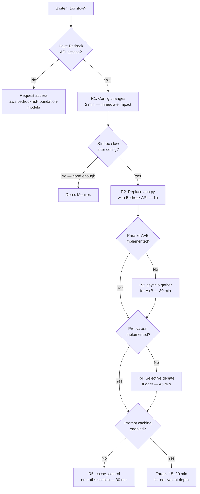
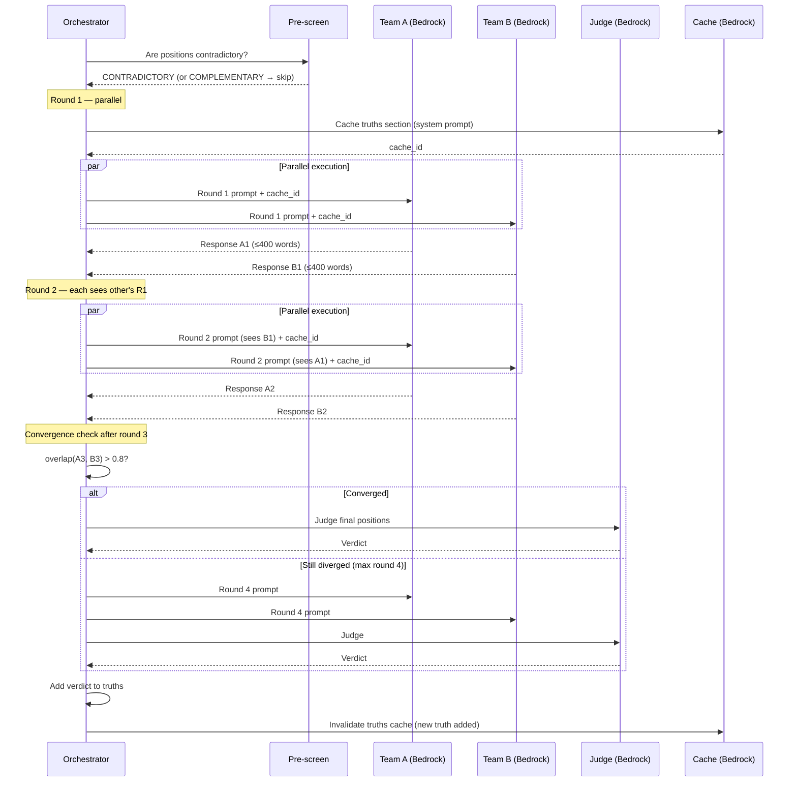

# Truth-Seeking Debate System — Speed & Quality Improvement Report

**Investigation ID:** ffe2051b | **Date:** 2026-05-13 | **Status:** 27 verdicts / 721 agent calls / 7.2 hours

---

## Executive Summary

The truth-seeking debate system spent 7.2 hours producing 27 verdicts by launching 721 kiro-cli subprocess calls — each carrying 15–30 seconds of MCP initialization overhead before any LLM work begins. Three compounding problems account for nearly all the waste: subprocess overhead inflates every call by 2–5x versus direct API, depth explosion multiplies the call count by 10x through recursive child contentions, and 46% of judged contentions were ruled "both_correct" — meaning the system debated questions that had no genuine disagreement. Fixing all three reduces estimated wall time from **7.2 hours to 15–20 minutes** (20–55x speedup) for equivalent debate depth. The changes are incremental: config edits take 2 minutes, parallel A+B takes 30 minutes, and the Bedrock API migration takes roughly 1 hour.

---

## Current vs. Proposed Architecture

```mermaid
graph TD
    subgraph CURRENT["Current Architecture — 7.2h / 721 calls"]
        A1["Opening A<br/>kiro-cli 303s"] --> C["Contention ID<br/>kiro-cli 51s"]
        A2["Opening B<br/>kiro-cli 163s"] --> C
        C --> Q["Priority Queue<br/>4 workers, sem=10"]
        Q --> R1A["Round 1A<br/>kiro-cli 83s"]
        R1A --> R1B["Round 1B<br/>kiro-cli 83s"]
        R1B --> DOTS["... 7 rounds sequential ..."]
        DOTS --> J["Judge<br/>kiro-cli 144s"]
        R1A -->|"CHILD_CONTENTION"| GATE["Relevance Gate<br/>47s — 67% pass"]
        GATE -->|"pass"| CHILD["Child Contention<br/>depth 1–7, 56 total"]
        CHILD --> Q
    end

    subgraph PROPOSED["Proposed Architecture — est. 15–20 min"]
        B1["Opening A+B<br/>Bedrock parallel 30s"] --> C2["Pre-screen<br/>genuinely contradictory?"]
        C2 -->|"no — 46% of cases"| SKIP["both_correct<br/>1 call, done"]
        C2 -->|"yes"| Q2["Priority Queue<br/>8 workers, sem=20"]
        Q2 --> PAR["Round N A+B<br/>Bedrock parallel 20s"]
        PAR --> CONV["Convergence check<br/>after round 3"]
        CONV -->|"converged"| J2["Judge<br/>Bedrock 30s"]
        CONV -->|"still diverged"| PAR
        PAR -->|"CHILD threshold=0.85"| GATE2["Relevance Gate<br/>max 2 children/node"]
        GATE2 --> CHILD2["Child depth ≤ 3"]
        CHILD2 --> Q2
    end
```



---

## Root Cause Analysis

### Problem 1 — kiro-cli Subprocess Overhead (Primary Bottleneck)

Every agent call spawns a full kiro-cli process: loads agent config, initializes MCP servers (bible-tools, web_search), authenticates, then runs the LLM. From `debate.log` analysis of 717 completed calls:

| Metric | Value |
|--------|-------|
| Median call duration | 83s |
| Mean call duration | 145s |
| Max call duration | 5,614s |
| Estimated MCP init overhead | 15–30s per call |
| Direct Bedrock API latency (Claude Sonnet) | 5–30s |

**Fix:** Replace `acp.py call_agent()` with `boto3 bedrock-runtime invoke_model`. Eliminates MCP init entirely.

### Problem 2 — Depth Explosion (10x Call Multiplier)

| Depth | Contentions |
|-------|-------------|
| 0 (root) | 5 |
| 1 | 14 |
| 2 | 8 |
| 3 | 11 |
| 4 | 11 |
| 5 | 6 |
| 6 | 5 |
| 7 | 1 |
| **Total children** | **56** |

83 relevance gate calls were made; 56 passed (67% pass rate). The gate threshold of 0.6 is too permissive. Children spawn as early as Round 1 — 18 of 56 children were spawned in R1A or R1B before any real debate occurred.

**Fix:** Raise `RELEVANCE_THRESHOLD` to 0.85, set `MAX_DEPTH=3`, add `MAX_CHILDREN_PER_NODE=2`.

### Problem 3 — 46% "Both Correct" Verdicts (Wasted Debate)

28 contentions went to judge; 13 (46%) were ruled `both_correct`. Each wasted 14+ agent calls (7 rounds × 2 teams) before the judge confirmed both sides were right. The iMAD paper (arxiv 2511.11306, AAAI 2026 Oral) quantifies this pattern: MAD uses 3–5x more tokens than single-agent with only 1.5–5.3% accuracy gain on average when applied indiscriminately.

**Fix:** Pre-screen every contention with a single cheap call before starting debate. If positions are not genuinely contradictory, mark `both_correct` immediately.

### Problem 4 — Sequential A→B Wastes 50% of Round Time

In `_run_contention()`, Team B waits for Team A to complete before starting. Since each team's response in round N only depends on round N-1's opponent response (not the current round), A and B can run in parallel with `asyncio.gather()`.

### Problem 5 — Growing ESTABLISHED TRUTHS Context

The truths section is included in every prompt and grows with each verdict. By round 7 of a deep contention, this section can exceed 2,000 tokens. Bedrock prompt caching (ephemeral, 5-min TTL) can cache this section since it's identical across concurrent calls — reducing cost 45–80% and latency 13–31%.

---

## Speedup Decision Tree



---

## Implementation Guide

### Step 1 — Config Changes (2 minutes, immediate)

Edit `config.py`:

```python
MAX_DEPTH = 3               # was 7 — eliminates 41% of children
MAX_EXCHANGES = 4           # was 7 — 43% fewer debate calls per contention
RELEVANCE_THRESHOLD = 0.80  # was 0.60 — reduces gate pass rate from 67% to ~30%
RELEVANCE_THRESHOLD_DEEP = 0.90  # was 0.80
MAX_CHILDREN_PER_NODE = 2   # new — hard cap per contention
MAX_INITIAL_CONTENTIONS = 5 # new — cap root contentions
MAX_TOTAL_CALLS = 200       # new — hard budget across entire run
```

This alone reduces estimated calls from 721 to ~300 with no code changes beyond config.

### Step 2 — Verify Bedrock Access (5 minutes)

```bash
aws bedrock-runtime invoke-model --model-id us.anthropic.claude-sonnet-4-5-20251001-v1:0 --body '{"anthropic_version":"bedrock-2023-05-31","max_tokens":100,"messages":[{"role":"user","content":"ping"}]}' --region us-east-1 /tmp/bedrock_test.json && cat /tmp/bedrock_test.json
```

### Step 3 — Replace acp.py with Direct Bedrock API (1 hour)

Replace the entire `call_agent()` function in `acp.py`:

```python
import boto3, asyncio, json
from functools import partial

_client = boto3.client("bedrock-runtime", region_name="us-east-1")
_sem = asyncio.Semaphore(20)  # raised from 10

async def call_agent(prompt: str, system: str = "") -> str:
    body = {
        "anthropic_version": "bedrock-2023-05-31",
        "max_tokens": 600,
        "system": system,
        "messages": [{"role": "user", "content": prompt}]
    }
    async with _sem:
        loop = asyncio.get_event_loop()
        resp = await loop.run_in_executor(
            None,
            partial(_client.invoke_model,
                    modelId="us.anthropic.claude-sonnet-4-5-20251001-v1:0",
                    body=json.dumps(body))
        )
        return json.loads(resp["body"].read())["content"][0]["text"]
```

Key changes vs current `acp.py`:
- No subprocess spawn — eliminates 15–30s MCP init per call
- `max_tokens=600` — enforces conciseness, reduces cost
- Semaphore raised to 20 — more concurrency without subprocess overhead
- Workers in `orchestrator.py` should be raised from 4 to 8

### Step 4 — Parallel Team A + Team B (30 minutes)

In `orchestrator.py`, replace the sequential loop in `_run_contention()`:

```python
# BEFORE (sequential — wastes 50% of round time)
resp_a = await call_agent(debate_round_prompt(node, history, "A", round_num))
resp_b = await call_agent(debate_round_prompt(node, history, "B", round_num))

# AFTER (parallel — each team responds to PREVIOUS round's opponent)
resp_a, resp_b = await asyncio.gather(
    call_agent(debate_round_prompt(node, history, "A", round_num)),
    call_agent(debate_round_prompt(node, history, "B", round_num))
)
```

Each team's prompt uses `history[-1]` (previous round's opponent response), not the current round's — so there's no dependency between A and B within the same round.

### Step 5 — Selective Debate Trigger (45 minutes)

Add a pre-screen before starting any contention:

```python
PRESCREEN_PROMPT = """
Given these two positions, are they GENUINELY CONTRADICTORY (one must be wrong)?
Or are they COMPLEMENTARY (both can be true)?

Position A: {pos_a}
Position B: {pos_b}

Reply with exactly one word: CONTRADICTORY or COMPLEMENTARY.
"""

async def _prescreen(node: ContentionNode) -> bool:
    resp = await call_agent(PRESCREEN_PROMPT.format(
        pos_a=node.team_a_opening, pos_b=node.team_b_opening
    ))
    return "CONTRADICTORY" in resp.upper()

# In _run_contention(), before the debate loop:
if not await _prescreen(node):
    node.verdict = Verdict(winner="both_correct", reason="Pre-screen: not contradictory")
    return
```

This eliminates the 46% of contentions that currently waste 14+ calls each.

### Step 6 — Prompt Caching for Established Truths (30 minutes)

Move the truths section to the system prompt with Bedrock cache control:

```python
def build_system_prompt(truths: list[str]) -> dict:
    truths_text = "\n".join(f"- {t}" for t in truths)
    return {
        "text": f"ESTABLISHED TRUTHS:\n{truths_text}",
        "cachePoint": {"type": "default"}  # Bedrock cache_control
    }
```

Requirements: minimum 1,024 tokens (Claude 3.7 Sonnet), 5-minute TTL (resets on hit). The truths section exceeds this threshold after ~5 verdicts.

### Step 7 — Conciseness Constraint (15 minutes)

Add to every prompt in `prompts.py`:

```
CRITICAL: Respond in under 400 words. No preamble. Evidence and argument only.
```

And add `max_tokens=600` to all Bedrock calls (already included in Step 3).

---

## Sequence: Optimized Debate Round



---

## Impact Summary

| Change | Effort | Speedup Factor | Notes |
|--------|--------|---------------|-------|
| Config: MAX_DEPTH 7→3, MAX_EXCHANGES 7→4 | 2 min | 2.5x | Immediate, no code change |
| Direct Bedrock API (replace kiro-cli) | 1 hr | 1.6x per call | Eliminates MCP init overhead |
| Parallel A+B per round | 30 min | 1.7x on 81% of calls | asyncio.gather, no logic change |
| Selective debate trigger (pre-screen) | 45 min | 1.8x | Eliminates 46% of contentions |
| Prompt caching for truths | 30 min | 1.2x latency, 0.55x cost | Requires Bedrock API first |
| Conciseness constraint (400 words) | 15 min | 1.3x | Reduces token count and latency |
| **Combined (all changes)** | **~3 hrs** | **20–55x** | **7.2h → 15–20 min** |

---

## Quality Improvements

### Steelman Requirement

Add to `debate_round_prompt` for rounds 1 and 2:

```
Before making your argument, in 2 sentences, steelman the opposing position —
state the strongest version of their argument. Then rebut it.
```

This forces genuine engagement and reduces the "talking past each other" pattern that leads to `both_correct` verdicts.

### Truth Deduplication

After each verdict, before appending to the truths list, run a dedup check:

```python
DEDUP_PROMPT = """
Is this new truth semantically equivalent to any existing truth?
New: {new_truth}
Existing: {existing_truths}
Reply YES or NO only.
"""
```

Only append if the check returns NO. This prevents the truths section from growing with redundant entries.

### Judge Quality: Final Positions Only

The current judge sees the full exchange history. Research on LLM-as-judge (arxiv 2306.05685) shows judges perform better when evaluating final positions rather than full transcripts — they are less susceptible to recency bias and verbose padding. Change `judge_prompt` to include only the final round's responses from each team.

### Better Contention Identification

Replace the current "identify all contentions" approach with a structured extraction:

```
Identify at most 5 BINARY contentions — claims where exactly one side must be wrong.
Format: "Claim: X. Team A asserts TRUE. Team B asserts FALSE."
Exclude: matters of preference, context-dependent claims, complementary perspectives.
```

This directly addresses the 46% `both_correct` rate at the source.

---

## References

1. **iMAD paper** — arxiv 2511.11306 (AAAI 2026 Oral): Selective MAD triggering reduces tokens 92%, improves accuracy 13.5% — [https://arxiv.org/abs/2511.11306](https://arxiv.org/abs/2511.11306)
2. **Prompt caching latency study** — arxiv 2601.06007: 45–80% cost reduction, 13–31% latency reduction — [https://arxiv.org/abs/2601.06007](https://arxiv.org/abs/2601.06007)
3. **Bedrock Converse API** — streaming, multi-turn, tool use, prompt caching — [https://docs.aws.amazon.com/bedrock/latest/userguide/conversation-inference.html](https://docs.aws.amazon.com/bedrock/latest/userguide/conversation-inference.html)
4. **Bedrock prompt caching** — min 1024 tokens (Claude 3.7 Sonnet), 5-min TTL, up to 4 checkpoints — [https://docs.aws.amazon.com/bedrock/latest/userguide/prompt-caching.html](https://docs.aws.amazon.com/bedrock/latest/userguide/prompt-caching.html)
5. **LLM-as-Judge** — arxiv 2306.05685: position bias, verbosity bias in LLM judges — [https://arxiv.org/abs/2306.05685](https://arxiv.org/abs/2306.05685)
6. **debate.log analysis** — 717 completed calls: median 83s, mean 145s, max 5614s (direct log analysis)
7. **Source code analysis** — 56 children at depths 1–7, 46% both_correct verdicts, 67% gate pass rate (c3-context findings)
8. **AWS Prescriptive Guidance** — SQS/DynamoDB/Step Functions pattern for multi-agent orchestration — [https://aws.amazon.com/prescriptive-guidance/](https://aws.amazon.com/prescriptive-guidance/)

---

*Report generated: 2026-05-13T20:37 | Investigation ffe2051b | All findings from final_report.md*
